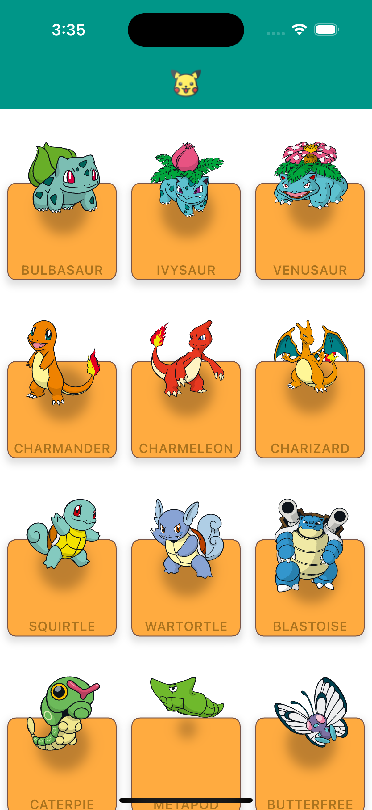
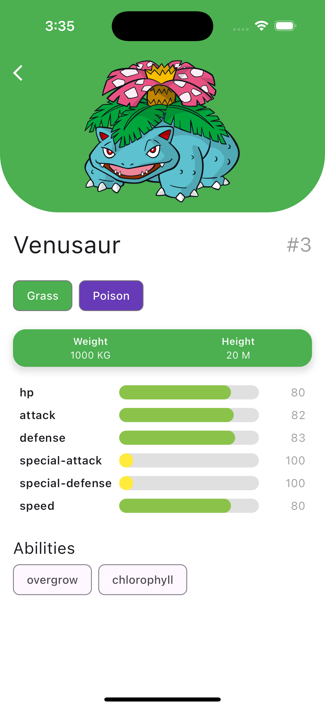

# Proyecto Prueba técnica con PokeAPI

* Proyecto para prueba técnica utilizando la API de ``https://pokeapi.co/api/v2/``

## Características

* Paginación.
* Información detallada de cada Pokémon.
* Diseño intuitivo y fácil de usar.

## Instalación

1. Abrir terminal y ejecutar comando ``flutter pub get`` para instalar las dependencias necesarias.
2. Ejecutar comando ``flutter run`` para ejecutar el proyecto e inicializar la aplicación.

## Desarrollo 

* Navegación: GoRouter
* Gestor de estado: flutter_riverpod
* Cliente HTTP: Dio
* Arquitectura: Clean Architecture
* Testing: Mockito & build_runner

## Testing

* El testing se realizó con la librería ``Mockito`` que utiliza generación de código para generar los Mocks.

* Antes de ejecutar los tests, es necesario generar los Mocks correspondientes.

1. Abrir la terminal y ejecutar comando ``dart run build_runner build`` para generar los Mocks.
2. Ejecutar comando ``flutter test`` para realizar los tests.

## Imágenes
<row> 

  
  

</row>
